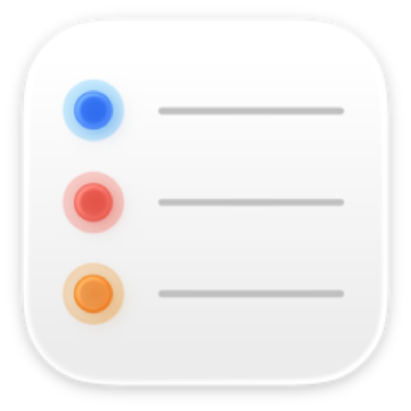

<p align="center">
  
</p>

# apple-reminders-mcp

A local MCP server, written in Swift, exposing the macOS **Reminders** app to Claude
through `EventKit`. It ships as a Claude extension.

No network, no credentials, no cloud API. iCloud is only the sync engine that fills the
local reminder store; this server reads and writes that local store, and the gate is
macOS **privacy consent** rather than authentication.

Calendar events are a separate EventKit entity with a separate permission, and are not
exposed here.

Not affiliated with or endorsed by Apple Inc.

## Requirements

- macOS 15 or later
- Swift 6.0 or later (Xcode 26 ships it)
- A code signing identity. Ad-hoc works, but every rebuild then asks for permission
  again — see [Signing](#signing-and-why-it-is-not-optional).

## Tools

| Tool | Kind | What it does |
|---|---|---|
| `reminders_status` | read | Reports the permission, the binary in use and its defaults. Reads no reminders. |
| `reminder_lists` | read | Every list, its account, and whether it accepts writes. |
| `reminders_search` | read | Reminders by text, list, completion state and due date. Echoes the filters it used. |
| `reminder_get` | read | Full record for one id, including whether it can still be edited. |
| `create_reminder` | write | Adds a reminder. Cannot create a repeating one. |
| `update_reminder` | write | Changes fields. Refuses reminders already completed. |
| `complete_reminder` | write | Ticks one off, or reopens one ticked off by mistake. |
| `delete_reminder` | **destructive** | Permanent. Requires `confirm: true`. Refuses completed reminders. |
| `create_list` | write | Adds an empty list, in the default list's account unless told otherwise. |
| `update_list` | write | Renames a list or changes its colour. |
| `delete_list` | **destructive** | Permanent. Requires `confirm: true`. Refuses any list that still holds reminders. |

## Frameworks and APIs

| Used | For | Reference |
|---|---|---|
| EventKit — `EKEventStore`, `EKReminder`, `EKCalendar`, `EKAlarm`, `EKRecurrenceRule`, `EKSource` | Every read and write | [EventKit](https://developer.apple.com/documentation/eventkit) |
| CoreGraphics — `CGColor`, `CGColorSpace` | Reading and setting a list's colour | [Core Graphics](https://developer.apple.com/documentation/coregraphics) |
| `NSRemindersFullAccessUsageDescription` | The consent string macOS shows | [Information Property List](https://developer.apple.com/documentation/bundleresources/information-property-list/nsremindersfullaccessusagedescription) |

EventKit areas this server does not use: `EKEvent` and `EKParticipant` (a separate entity
with its own permission), `EKStructuredLocation` (so no location-based alarm), and
`EKRecurrenceDayOfWeek` — recurrence is read and summarised, never constructed.

## The rules worth knowing before you use it

**Completion is the record.** `update_reminder` and `delete_reminder` refuse any reminder
that is already completed. Ticking something off is evidence that it was done, and this
server does not rewrite evidence.

**Reopening always works.** `complete_reminder(completed=false)` is the one change allowed
against a completed reminder, and it is how a mistaken tick is undone:

```
complete_reminder(id="…", completed=false)   → an ordinary open reminder again
update_reminder(id="…", title="…")           → now accepted
```

Clearing finished reminders in bulk is a job for Reminders.app. That is the deliberate
trade: this server cannot destroy the record of what you have done.

**Ticking something off twice does nothing.** EventKit keeps `completed` and
`completionDate` in lockstep, so re-completing an already-completed reminder would stamp
it with the current time and lose when the thing was actually done. The server compares
first and writes nothing.

**Search looks at open reminders by default.** Pass `status="completed"` or `"any"` when
the question is about what has already been done.

**Dates take exactly three forms:**

```
2026-08-12                  that day, no particular time
2026-08-12T09:00            local time
2026-08-12T09:00:00+02:00   explicit offset
```

A reminder with no due date at all is perfectly normal, and unfiltered searches list the
undated ones last. Passing a plain day as `due_to` covers that **whole day**, not up to
its midnight.

**A due time gets an alarm.** EventKit creates none by itself — unlike Reminders.app — so
a reminder saved with a time would never actually notify. `create_reminder` adds one at
the due time and says so; pass `alarms: []` for one that stays silent. A whole-day due
date gets no alarm, matching what Reminders.app does for a task due "today". Alarms are
offsets from the due date (`"-15m"`, `"-1h"`, `"-1d"`, `"0"`), so removing the due date
removes them too.

**Priorities are words**, not RFC 5545 numbers: `none`, `high`, `medium`, `low`. Reading
is wider than writing — a reminder another client stored as priority 3 reads back as
`high`.

**EventKit cannot create repeating reminders.** Existing ones are reported, and completing
one rolls it forward to its next due date rather than closing it, but the rule itself has
to be set up in Reminders.app.

**A list is never deleted with anything in it.** `removeCalendar` takes every reminder in
the list with it, completed ones included — which would be a back door around the rule
above. `delete_list` counts the contents first and refuses if there are any. No
confirmation flag overrides it: empty the list first, or delete it in Reminders.app where
you can see what you are losing.

**Lists are addressed by name, and a shared name is refused.** An iCloud "Reminders"
alongside a local one is ordinary, and picking whichever EventKit enumerated first would
mean renaming or deleting on a guess — or filing a reminder into the list you were not
looking at. `create_reminder`, `update_list` and `delete_list` all refuse an ambiguous name
and tell you which accounts hold it; pass `account="…"` to break the tie.

Searching is the exception, and deliberately so: `reminders_search` with `lists=["Personal"]`
returns what is in *every* list of that name. A read that shows you more hides nothing,
which is the failure the rule above exists to prevent.

**Colours are names or hex.** `red`, `orange`, `yellow`, `green`, `mint`, `teal`, `blue`,
`indigo`, `purple`, `pink`, `brown`, `gray` — Apple's system palette, which is what
Reminders.app draws its own swatches from — or a value like `#FF9500`. Reading back
reports the name when the colour is one of them and the hex when it is not.

**Identifiers are not sync-proof.** A full account resync regenerates them, which is why
every workflow starts with a search.

## Install

### 1. Build the bundle

`MCPB_SIGN_IDENTITY` takes an identity that exists on this Mac — copy it from here rather
than typing it, because `codesign` rejects a near-miss with `no identity found` and
`pack.sh` then stops before writing a bundle:

```bash
security find-identity -v -p codesigning
```

```bash
MCPB_SIGN_IDENTITY="Apple Development: …" ./scripts/pack.sh
```

That produces `dist/apple-reminders-mcp.mcpb`. Without the identity it signs ad-hoc, which
works but re-prompts for permission on every rebuild.

A failed run leaves **no** bundle behind rather than the previous one: `pack.sh` clears
`dist/` before it builds, so a stale bundle can never be mistaken for the one a broken
build was supposed to produce.

### 2. Install it

Open the `.mcpb` with Claude, or drag it onto the app.

### 3. Grant the permission

The first call to a tool that reads reminders triggers the macOS consent dialog. The grant
appears under:

```
System Settings → Privacy & Security → Reminders
(Spanish UI: Ajustes del Sistema → Privacidad y seguridad → Recordatorios)
```

`requestFullAccessToReminders` is the only access this server ever requests. EventKit can
still report a write-only grant, and `reminders_status` says so plainly rather than
failing later.

The binary is **its own privacy subject**: Claude Desktop launches MCP servers through
`Contents/Helpers/disclaimer`, which calls `responsibility_spawnattrs_setdisclaim`, so the
child cannot inherit the host app's permissions — and Claude.app declares no Reminders
usage description anyway. Hence the `Info.plist` embedded at link time.

If no dialog ever appears:

```bash
otool -P extension/server/apple-reminders-mcp | grep NSRemindersFullAccessUsageDescription
```

### Signing, and why it is not optional

`swift build` leaves a signature the linker generated, flagged `linker-signed`. macOS
treats that as signed by nobody: it produces **no designated requirement**, so there is
nothing to anchor a permission to except the binary's cdhash — and every rebuild changes
that. Worse, a linker-signed binary never gets a consent dialog at all; the request
returns with the status still "not determined".

Signing with a real certificate produces a requirement anchored to the bundle identifier
and the certificate instead:

```
designated => identifier "codes.eneko.apple-reminders-mcp" and anchor apple generic
              and certificate leaf[subject.CN] = "Apple Development: …"
```

That survives rebuilds. `pack.sh` prints the requirement on every build, so a silent
regression to ad-hoc is visible immediately.

**Changing certificate re-prompts once.** The requirement quotes the certificate, so moving
between ad-hoc, Apple Development and Developer ID each costs one fresh round of consent.

### Preparing something to distribute

```bash
MCPB_HARDENED=1 MCPB_SIGN_IDENTITY="Developer ID Application: …" ./scripts/pack.sh
```

That adds the hardened runtime and a secure timestamp, which notarisation requires.
EventKit is reached directly and needs no entitlements.

## Tool switches

Plug and play: there is nothing to configure. Every tool can be turned on and off
individually, because the bundle declares them all in its manifest — that is where policy
lives, not in this code. Turning off the seven write tools — `create_reminder`,
`update_reminder`, `complete_reminder`, `delete_reminder`, `create_list`, `update_list`
and `delete_list` — leaves a strictly read-only server.

**Reinstalling may reset the switches.** Check them after every install.

## Manual registration instead

```json
{
  "mcpServers": {
    "Apple Reminders": {
      "command": "/absolute/path/to/apple-reminders-mcp/.build/release/apple-reminders-mcp"
    }
  }
}
```

You lose the per-tool switches. Do not do both at once: two registrations under the same
display name collide, and `reminders_status` prints the binary path precisely so you can
tell which one answered.

## Known limits

### Sections inside a list cannot be touched at all

Not by this server, and not by any app other than Reminders.app. **Sections are not an
EventKit concept**, so there is nothing to expose — this is a missing API, not a decision
taken here. Checked four ways against the macOS 26.5 SDK and system:

| Surface | Result |
|---|---|
| `EventKit.framework` headers | No `section` anywhere. `EKCalendar`, `EKReminder` and `EKCalendarItem` carry no section property, and no `EKReminderSection` type exists. |
| Reminders.app scripting dictionary (`sdef`) | Three classes only — `account`, `list`, `reminder`. No `section`. |
| Reminders' App Intents metadata | No section-related intent, so Shortcuts cannot reach one either. |
| Reminders.app binary | Sections appear as `Reminders`-module Swift symbols (`sectionIDByReminderID`, `TTRMEditSections…`) — **inside the app itself**, above the EventKit layer, not in any framework a second process can link. |

The remaining routes are all ones this repo will not take: private `ReminderKit` symbols,
UI scripting through the accessibility API, or reading the reminder store's SQLite file
directly. Each is unauditable, breaks without warning, and the last is forbidden outright
by `CLAUDE.md`.

So the tools say so out loud instead. `create_list` and `update_list` both carry the
warning, and the server's own instructions state it in capitals, because the realistic
failure is not an error — it is a model asked for a section quietly creating a **list**
and reporting success.

### The rest

- **List *groups* are not exposed either.** Reminders.app can nest lists inside a group;
  EventKit's calendar list is flat and has no parent. (The AppleScript dictionary does
  model it, as a `list` whose `container` is another `list` — but that is Reminders.app's
  own surface, not EventKit's.)
- **A list cannot be moved between accounts.** `EKCalendar.source` is settable only while
  the list is new; EventKit's header is explicit that it is read-only once saved.
- **List icons are not exposed.** Reminders.app stores an emblem alongside the colour;
  EventKit offers colour only.
- **No repeating reminders can be created.** That is an EventKit limitation, not a choice.
  Existing ones are read, and completing one rolls it forward.
- **Completed reminders cannot be edited or deleted**, by design. Reopen first, or use
  Reminders.app.
- **Subtasks are not exposed.** EventKit has no public API for the parent/child
  relationship Reminders.app shows.
- **Location-based alarms are not exposed.** Only time offsets from the due date.
- **Identifiers are not durable.** Resynchronising an account regenerates them.

## Development

```bash
swift build
swift test
```

86 tests across three suites, all against an in-memory fake at a fixed instant. They need
no permissions and never touch real reminders — see `CLAUDE.md`, whose first section is
the rule that makes that non-negotiable.

Manual verification against a live reminder store is the owner's job.

## Licence

MIT.
